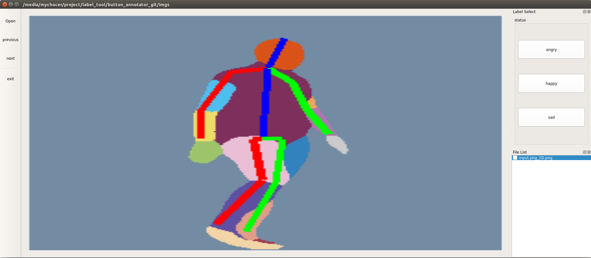

## Introduction

Click-by-Mouse Annotator: A simple single-label annotator  
    Only one operation(Click by Mouse) needed to annotate an image 

## Dependence

- `Python2`
- `PyQt5`

## Usage

# Step1

Edit `config.yaml` to set your label name and corresponding label id

# Step2

Run the script
```bash
python label_tool_button.py
```

## Layout



## Function

- annotate images,  and save annotation file(`.json`) in the same directory of image
- click the label button, to annotate an image and switch to next image

|   HotKey   |   Description  |
| ---------- | -------------- |
| `Ctrl + O` | Open Image Directory |
| `Ctrl + Q` | Exit |
| `A` | Switch to the previous image |
| `D` | Switch to the next image     |


